# はじめてでも試しやすいFPGA:   Sipeed TANG NANO 9K

<!--
_class: lead
_paginate: false
_header: ""
-->

## 自己紹介

* 井田　健太
* お仕事: 組込みソフト, FPGAの論理設計
* RISC-V CPU自作本とか組込みRust本お手伝いしました (共著)
* インターフェース(CQ出版)の特集記事書いてます
* twitter: @ciniml

## Sipeed Tang Nano 9Kとは

* Sipeed社が製造・販売するFPGAボード
* GOWIN社のLittle BeeシリーズFPGAを搭載
  * GW1NR-LV9QN88PC6/I5
* 秋月電子通商で2500円で購入可能

https://akizukidenshi.com/catalog/g/gM-17448/

## GOWIN Little BeeシリーズFPGA **GW1NR**

* GOWIN Little Bee
  * フラッシュ内蔵 小規模FPGAファミリ (~9K LUT4)
* **GW1N** で始まる複数のグループがある
  * GW1N - 最もシンプル
  * **GW1NR** - SDRAM/PSRAM内蔵 **Tang Nano 9Kに搭載**
  * GW1NSR - Arm Cortex-M3ハードマクロ搭載
* 他にもいくつかファミリ・シリーズがある

https://www.gowinsemi.com/en/product/detail/46/

## Tang Nano 9Kの構成

## Tang Nano 9Kの構成

* 水晶発振器 27[MHz]
  * DVI信号生成に適した周波数
* USB-JTAG回路
  * USB Type-C接続で FPGAに書き込み可能
* HDMIコネクタ
  * HDMI接続の モニターを接続可能

## Tang Nano 9Kの構成

* SPIフラッシュ
  * CPU用の ソフトウェアなど格納用
* LED, プッシュスイッチ
* TFカードスロット

## GOWIN FPGAの開発環境 GOWIN EDA

* GOWINが提供する開発環境
* 2つのエディション
  * Standard - 要ライセンス申請、全デバイス対応可能
  * Education -  ライセンス申請不要、商用利用不可、一部デバイスのみ対応可能

## GOWIN EDAの入手

* GOWINのサイトからダウンロードして入手可能
* 対応プラットフォーム - Windows, Linux
* ライセンス申請
  * サイトにあるフォームから申請可能

https://www.gowinsemi.com/ja/support/download_eda/
https://www.gowinsemi.com/ja/support/license/

## GOWIN EDAの機能

* VHDL2008, SystemVerilog 2017入力の合成
* GOWINが提供する各種IPコアのカスタマイズと生成
* FPGA自体のJTAGによるコンフィグレーション
* FPGA内蔵フラッシュ等へのビットストリーム書き込み
* デバッグ用ロジックアナライザ回路の埋め込みと操作

## GOWIN EDAに無い機能

* IPベース設計ツール
  * 現在のところIPコアのインスタンス化と接続は手動
* シミュレータ
  * 別途商用のシミュレータ等を用意する必要あり
  * GOWINがMetricsと提携したので DSim Cloud Simulatorが提供される可能性あり？

# Tang Nano 9Kの使用例

## 2500円ボードで始めるFPGA開発 Vol.2

* Interface 2022年12月号の別冊付録 (CQ出版)
  * 2022年10月25日発売
* 本セミナーのスピーカー2名 + 1名の3名で執筆
* Tang Nano 9Kの使用方法・使用例を紹介

## Tang Nano 9Kの使用例

* マトリクスLEDのダイナミック点灯制御
* I2Cスレーブの実装
* ステッピング・モーターの台形制御
* DVI信号生成
* RISC-V CPUコアの実装と周辺回路接続
* Python高位合成系での各種回路の実装

## 