# はじめてでも試しやすいFPGA:   Sipeed TANG NANO 9K

<!--
_class: lead
_paginate: false
_header: ""
-->

## 自己紹介

* 井田　健太
* お仕事: 組込みソフト, FPGAの論理設計
* RISC-V CPU自作本とか組込みRust本お手伝いしました (共著)
* インターフェース(CQ出版)の特集記事書いてます
* twitter: @ciniml

## Sipeed Tang Nano 9Kとは

* Sipeed社が製造・販売するFPGAボード
* GOWIN社のLittle BeeシリーズFPGAを搭載
  * GW1NR-LV9QN88PC6/I5
* 秋月電子通商で2500円で購入可能

https://akizukidenshi.com/catalog/g/gM-17448/

## GOWIN Little BeeシリーズFPGA **GW1NR**

* GOWIN Little Bee
  * フラッシュ内蔵 小規模FPGAファミリ (~9K LUT4)
* **GW1N** で始まる複数のグループがある
  * GW1N - 最もシンプル
  * GW1NSR - Arm Cortex-M3ハードマクロ搭載
  * **GW1NR** - **Tang Nano 9Kに搭載** SDRAM/PSRAM内蔵 
* 他にもいくつかファミリ・シリーズがある

https://www.gowinsemi.com/en/product/detail/46/

## Tang Nano 9Kの構成

* USB-JTAG回路
  * USB Type-C接続で FPGAに書き込み可能
* HDMIコネクタ
  * HDMI接続の モニターを接続可能
* 水晶発振器 27[MHz]
  * DVI信号生成に適した周波数

## Tang Nano 9Kの構成

* SPIフラッシュ
  * CPU用の ソフトウェアなど格納用
* LED, プッシュスイッチ
* TFカードスロット

## Tang Nano 9Kの構成

* パラレルLCDコネクタ
  * 所謂PSP液晶と呼ばれるピン配置の液晶を接続可能
* SPI LCDコネクタ
* 電源回路
  * FPGAや周辺回路が必要な電源を+5Vから生成

## Tang Nano 9Kの構成

## GOWIN FPGAの開発環境 GOWIN EDA

* GOWINが提供する開発環境
* 2つのエディション
  * Standard - 要ライセンス申請、全デバイス対応可能
  * Education -  ライセンス申請不要、商用利用不可、一部デバイスのみ対応可能

## GOWIN EDAの入手

* GOWINのサイトからダウンロードして入手可能
* 対応プラットフォーム - Windows, Linux
* ライセンス申請
  * サイトにあるフォームから申請可能

https://www.gowinsemi.com/ja/support/download_eda/
https://www.gowinsemi.com/ja/support/license/

## GOWIN EDAの機能

* VHDL2008, SystemVerilog 2017入力の合成
  * 各言語機能にどれくらい対応するかは要確認
* GOWINが提供する各種IPコアのカスタマイズと生成
* FPGA自体のJTAGによるコンフィグレーション
* FPGA内蔵フラッシュ等へのビットストリーム書き込み
* デバッグ用ロジックアナライザ回路の埋め込みと操作

## デバッグ機能 GOWIN Analyzer Oscilloscope

* 合成前・合成後のデザインにロジック・アナライザ機能を埋め込み
  * GUI上からトリガソース、クロック、記録対象のネットを設定

## デバッグ機能 GOWIN Analyzer Oscilloscope

* 書き込み後、トリガ条件などを設定して取り込み開始
* JTAG経由で取り込んだ波形を画面に表示

## GOWIN EDAに無い機能

* IPベース設計ツール
  * 現在のところIPコアのインスタンス化と接続は手動
* シミュレータ
  * 別途商用のシミュレータ等を用意する必要あり
  * GOWINがMetricsと提携したので DSim Cloud Simulatorが提供される可能性あり？

# Tang Nano 9Kの使用例

## 2500円ボードで始めるFPGA開発 Vol.2

* Interface 2022年12月号の別冊付録 (CQ出版)
  * 2022年10月25日発売
* 本セミナーのスピーカー2名 + 1名の3名で執筆
* Tang Nano 9Kの使用方法・使用例を紹介
  * GOWIN EDAのインストール手順
  * デザインの合成と書き込み

## Tang Nano 9Kの使用例

* マトリクスLEDのダイナミック点灯制御
* I2Cスレーブの実装
* ステッピング・モーターの台形制御
* DVI信号生成
* RISC-V CPUコアの実装と周辺回路接続
* Python高位合成系での各種回路の実装

# DVI信号生成

## 概要

* Tang Nano 9KのHDMIコネクタからDVI信号を出力
* HDMI入力対応モニタでFPGAで生成した画像を表示
  * 1280x720 60Hzの映像信号

## システム構成 (1/3)

* 映像信号の基準クロック (ピクセルクロック) 生成
  * 27[MHz] 水晶発振子 x 11/4 = 74.25[MHz]

* シリアライザのクロック生成
  * 27[MHz] 水晶発振子 x 55/4 = 371.25[MHz]

## システム構成 (2/3)

* テストパターン生成回路
  * 画面に表示する映像信号を生成
* DVI信号生成回路
  * DVI信号生成のためのTMDSエンコーダー回路

## システム構成 (3/3)

* 10:1シリアライザ
  * TMDSエンコーダの出力する10bitの信号を1bitの信号にシリアル化

## テストパターン生成回路

* 縦7色の帯の上に インターフェース誌の ロゴを重ね合わせる
* 画面内をロゴが移動するための座標計算

## DVI信号生成回路

* 2ビットの同期信号・8ビットの輝度信号を **TMDS** 方式にて10ビットに変換
* 2ビットの同期信号 → 4種類の値を固定の10ビット値に変換
* 8ビットの輝度信号 → 遷移回数最小化とDC成分均一化処理で10ビット値に変換

* 2021年8月号のトランジスタ技術のHDMI特集にアルゴリズム記載あり
  * もちろん小冊子内でも解説

## 同期信号の変換

* 映像信号の水平同期信号・垂直同期信号を変換
* ブランキング区間のみ
* ビット遷移回数が多くなるような値に固定で変換

| 入力 2bit | 出力 10bit |
|:---------|:------------|
| 2'b00 | 10'b1101010100 |
| 2'b01 | 10'b0010101011 |
| 2'b10 | 10'b0101010100 |
| 2'b11 | 10'b1010101011 |

## 輝度信号の変換

* アクティブ区間の輝度信号を変換
* ビット遷移回数が少なくなるように変換 (5回以下)
* DC成分平均化
  * いままでに出力した0, 1の個数が均等になるように調整

## 10:1シリアライザ **OSER10**

* 10ビットの信号を10倍のレートで 1ビット単位で出力する回路
* GW1Nシリーズに内蔵のプリミティブ
* ピクセルクロックと5倍のクロックが必要
* DVI信号生成回路の出力する 10ビットのTMDS信号を入力

## 合成結果

* リソース

| 名称     | 使用量           | 使用率(%) | 備考 |
|:---------|----------------:|----------:|:-----|
| Logic    | 396/8640        | 4 |     |
| Register | 131/6693        | 1 |     |
| IOLOGIC  | 4 OSER10        | 8 |     |
| BSRAM    | 1 pROM          | 3 | インターフェースのロゴ格納用 |
| PLL      | 2/2             | 100 | 74.25, 371.25 [MHz] 生成用 |

* Fmax 74.303 / 74.25[MHz]

# RISC-V CPUの組込み

## 概要

* Tang Nano 9Kのロジック規模は、RISC-V CPUコアを組み込むのに十分
  * 極端に省リソースの実装もあるが、概ね **2kLUT/2kFF** 程度あれば現実的に有用なコアを実装可能
* Sipeed自体もTang Nano 9K向けのサンプル・デザインを提供
* GOWINもLittle Bee向けにRISC-V CPUコアを提供
* 評価のため、上記サンプルを使わず **独自で** 組み込んでみる

## PicoRV32

* ISC Licenseで使用可能なRISC-V命令セット実装したCPUコア実装
* 機能
  * RV32IMC
    * (オプション) 乗除算命令 (M)
    * (オプション) 圧縮命令 (C)
  * 割り込み処理
  * 独自コプロセッサ・インターフェースでの周辺回路接続
* SipeedのサンプルやGOWIN提供のCPUコアでも使用
  * GOWINはPicoRV32のカスタム版を提供

## 実装内容 -  CPUからのマトリクスLED制御

* FPGA側の論理回路で8x8マトリクスLEDのダイナミック点灯回路を実装
* CPUからは **レジスタへの書き込みのみ** で点灯パターンを制御可能
  * c.f. CPUがGPIOを制御して ダイナミック点灯を行う

## システム構成

* PicoRV32のメモリバスに制御レジスタ8bit x8を実装
* マトリクスLED制御回路がレジスタ内容をもとにダイナミック点灯制御

## 合成結果

* リソース

| 名称     | 使用量           | 使用率(%) |
|:---------|----------------:|----------:|
| Logic    | 1951/8640        | 22 |
| Register | 799/6693        | 11 |
| BSRAM    | 3 SDPB, 1 pROM  | 15 |

* Fmax 57.198 / 27[MHz]

## 動作確認

* `C` `Q` を交互にずらして表示

## まとめ

* 9kLUT/6kFF のロジック規模のFPGAを搭載しており、 そこそこの規模の論理回路を実装可能
  * 組込み向けRISC-V CPU実装など
* 書き込み回路を搭載しており、 USBで接続するだけで書き込みが可能であり、手軽に使用できる
* 秋月電子通商にて購入可能であり、入手性が良い
* GOWIN EDAは最低限必要な機能がそろっている
* FPGA使えると便利なのでさわってみよう！